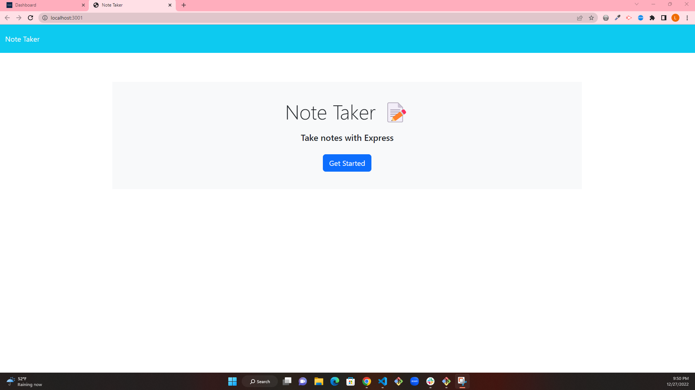
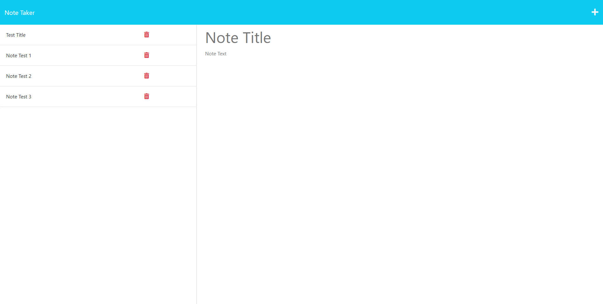
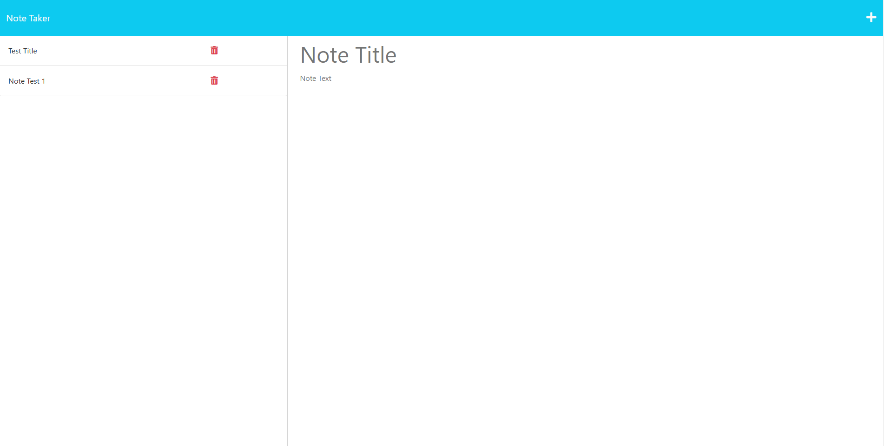

# Note Taker

## Description

A note taker is a web application that allows users to create, edit, and delete notes. It is typically implemented in JavaScript and can be accessed through a web browser.

## Table of Contents

- [Description](#description)
- [Usage](#usage)
- [Questions](#question)

## Usage

This is the link to my Webpage : https://stormy-mountain-33439.herokuapp.com/

This shows the layout of my application.

To use a note taker, a user can enter text into a text field and click a button to save the note. The note is then displayed in a list, along with any other notes that the user has created. The user can click on a specific note to view or edit it, or they can delete a note by clicking a button next to it.

## Question

If you have any questions about the repo, open and issue or contact me directly at linhklatt@yahoo.com. You can find more of my works at [linhklatt](email)
